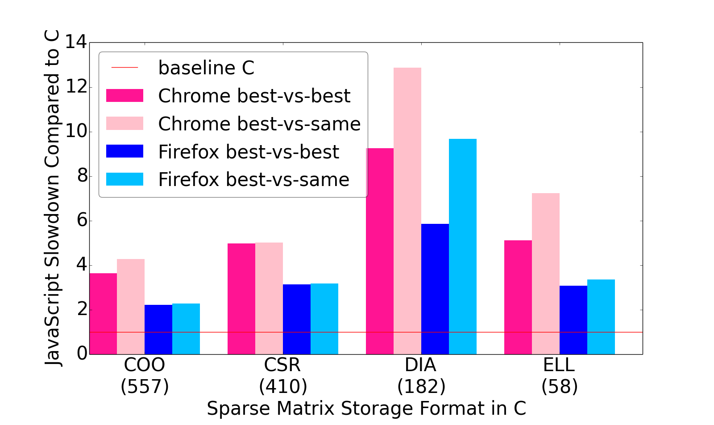

# Sparse matrices on the web
- [Table of Contents](#table-of-contents)
  * [Input Matrices](#input-matrices)
  * [Research Questions](#research-questions)
    + [RQ1 : Performance comparison between C and both JavaScript and WebAssembly](#rq1--performance-comparison-between-c-and-both-javascript-and-webassembly)
    + [RQ2 : Performance comparison and format difference between single- and double-precision for C, 
    JavaScript and WebAssembly](#rq2--performance-comparison-and-format-difference-between-single--and-double-precision-for-c-javascript-and-webassembly)
    + [RQ3 : Format difference between C and both JavaScript and WebAssembly](#rq3--format-difference-between-c-and-both-javascript-and-webassembly)
  * [Additional results based on size N](#additional-results-based-on-size-n)
## Input Matrices
We conducted our SpMV experiments for C, JavaScript and WebAssembly with 1,952 real-life examples of sparse matrices obtained from The SuiteSparse Matrix Collection (formerly the University of Florida Sparse Matrix Collection) at (https://sparse.tamu.edu). 
Please find the list of selected [input matrices](./input-matrices.txt) from the collection.

## Research Questions

   ### RQ1 : Performance comparison between C and both JavaScript and WebAssembly
 
   | Precision | JavaScript | WebAssembly |
   | :---: | :---: | :---: |
   | Single-precision |  |  |
   | Double-precision |  |  |
   
   ### RQ2 : Performance comparison and format difference between single- and double-precision for C, JavaScript and WebAssembly
    
   | x%-affinity | Single-Precision | Double-Precision |
   | --- | :---: | :---: |
   | 10% |  |  |
   | 25% |  |  |
   | 50% |  |  |
   
  
  ### RQ3 : Format difference between C and both JavaScript and WebAssembly
    
## Additional results based on size N
    ARQ1 : Performance comparison between C and both JavaScript and WebAssembly based on N
    Small matrices: N less than 512
    Large matrices: N more than 100,000
   ### JavaScript vs C
   | Precision | Small | Large |
   | :---: | :---: | :---: |
   | Single-precision |  |  |
   | Double-precision |  |  |
   
   ### WebAssembly vs C
   | Precision | Small | Large |
   | :---: | :---: | :---: |
   | Single-precision |  |  |
   | Double-precision |  |  |
